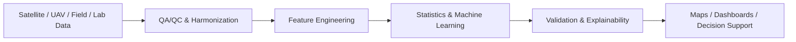

  

<h1 align="center">Priyanka Belbase</h1>

  <strong>Agricultural Data Science | Remote Sensing | GeoAI | Machine Learning | Precision Agriculture</strong>

  
  
  
  
  

  <a href="https://www.linkedin.com/in/priyanka-belbase/">LinkedIn</a> •
  <a href="https://scholar.google.com/citations?user=bkSmlQ8AAAAJ&hl=en&oi=ao">Google Scholar</a> •
  <a href="mailto:belbase.priyanka@gmail.com">Email</a>

---

I am completing a **Ph.D. in Earth System Science at Florida International University** and work at the intersection of **remote sensing, GIS, Python, machine learning, environmental science, and Earth observation**.

My work combines **satellite imagery, UAV observations, hyperspectral reflectance, field measurements, GIS, Python, and Google Earth Engine** to study vegetation condition, plant stress, land-surface change, flood risk, and other environmental processes. I am especially interested in building **reproducible geospatial workflows** that move from data acquisition and quality control through analysis, validation, visualization, and decision-support products.

---

## Core Strengths

- **Geospatial data science:** raster, vector, tabular, terrain, GPS, field, and Earth-observation data
- **Remote sensing:** Sentinel-1/2, Landsat, PlanetScope, NAIP, UAV, hyperspectral and multispectral data
- **Python & automation:** Python, ArcPy, NumPy, Pandas, GeoPandas, Rasterio/GDAL where applicable, scikit-learn, Matplotlib
- **Machine learning & GeoAI:** classification, regression, Random Forest, SVM, PCA, feature engineering, model evaluation
- **GIS & environmental modeling:** ArcGIS Pro, QGIS, Google Earth Engine, hydrology, terrain analysis, land-cover change, suitability modeling
- **Validation & data quality:** accuracy assessment, confusion matrices, spatial validation, metadata, QA/QC, reproducible processing
- **Version control & reproducibility:** Git, GitHub, requirements files, tests, documented project structures
- **Scientific communication:** peer-reviewed research, conference presentations, dashboards, technical reporting, and interdisciplinary collaboration

---

## Agricultural AI & Precision Agriculture Projects

I am extending my South Florida doctoral research into **end-to-end agricultural AI and decision-support projects** that connect field experiments, crop nutrition, hyperspectral sensing, weather, remote sensing, and machine learning. These projects are transparently labeled **In development** until the corresponding repositories and reproducible results are complete.

### 🌱 Dragon Fruit Yield & Phenology Forecasting — *In development*
**Machine Learning for Dragon Fruit Flowering, Fruit Set, and Yield Forecasting in South Florida**

An explainable ML workflow designed to integrate multi-year field experiments, crop species, nutrient treatments, high-tunnel/open-field environments, plant growth, spectral indicators, and weather variables to model flowering and fruit-set dynamics.

**Planned methods:** `Python` `R` `Random Forest` `Gradient Boosting` `XGBoost` `SHAP` `Grouped Cross-Validation` `Experimental Design`

**Decision question:** Which combinations of crop, management, environmental, nutrient, spectral, and weather factors are most predictive of flowering and fruit-set outcomes?

### 🧪 Dragon Fruit Precision Nutrition & Stress AI — *In development*
**Multisensor AI for Crop Nutrition and Stress Monitoring in South Florida Dragon Fruit**

A precision-agriculture workflow designed to combine soil chemistry, plant-tissue nutrients, hyperspectral reflectance, vegetation indices, crop-growth measurements, species, treatment, and production environment for nutrient-status and crop-stress modeling.

**Planned methods:** `Hyperspectral Remote Sensing` `Soil & Tissue Analytics` `PCA` `Random Forest` `SVM` `XGBoost` `Feature Importance` `Decision Support`

**Decision question:** Can spectral and environmental measurements provide reliable early indicators of plant nutrient status and stress when validated against field and laboratory measurements?

### 🔬 AI Dragon Fruit Disease Scouting & Decision Support — *In development*
**Explainable AI and Hyperspectral Decision Support for Early Crop Disease Scouting**

An end-to-end extension of my peer-reviewed plant-disease spectroscopy research, moving from spectral classification toward a reproducible scouting workflow with preprocessing, feature engineering, model validation, disease-risk scoring, explainability, and an interactive decision-support interface.

**Planned methods:** `Hyperspectral Spectroscopy` `Random Forest` `SVM` `PCA` `Cross-Validation` `Explainable AI` `Streamlit / Dashboard`

**Decision question:** How can validated spectral-ML outputs be translated into practical scouting priorities rather than remaining only as research-model predictions?

> **Transferability:** These projects use dragon fruit because I have real field, nutrient, spectral, disease, and experimental data from South Florida. The modeling, validation, data-engineering, and decision-support framework is designed to be transferable to other cropping systems when retrained and validated with crop-specific ground truth.

---

## Featured Projects

### 1. [Hyperspectral Plant Stress ML](https://github.com/belbasepriyanka/hyperspectral-plant-stress-ml)
Machine-learning workflow for hyperspectral plant-stress classification using spectral feature engineering, **PCA, Random Forest, SVM, train/test evaluation, and confusion matrices**.

**Tools:** `Python` `NumPy` `Pandas` `scikit-learn` `Matplotlib` `PCA` `Random Forest` `SVM`

> Portfolio demonstration: the included runnable example uses synthetic spectra and is explicitly separated from measured research data.

### 2. [Sentinel-2 Vegetation Health Monitoring](https://github.com/belbasepriyanka/sentinel2-vegetation-health-monitoring)
Reproducible Earth-observation workflow for vegetation monitoring using **Sentinel-2, NDVI, NDRE, GNDVI, NDWI, time-series analysis, anomaly screening, Python, and Google Earth Engine**.

**Tools:** `Sentinel-2` `Google Earth Engine` `Python` `Pandas` `NumPy` `Vegetation Indices` `Time Series`

> The local Python demo uses synthetic time-series data for reproducibility; the GEE workflow provides the pathway for real Sentinel-2 imagery.

### 3. [Geospatial Land-Cover ML](https://github.com/belbasepriyanka/geospatial-land-cover-ml)
Random Forest land-cover classification emphasizing **spatial-block validation** to reduce spatial data leakage and produce more defensible geospatial model evaluation.

**Tools:** `GeoAI` `Random Forest` `Spatial Validation` `Land Cover` `Python` `Accuracy Assessment`

> Portfolio demonstration: synthetic samples are used so the workflow can be reproduced without proprietary training data.

### 4. [Geospatial Raster ETL & QA/QC Pipeline](https://github.com/belbasepriyanka/Remote-Sensing-GIS-portfolio/tree/main/projects/geospatial-raster-etl-qaqc)
Applied raster data-engineering workflow for **metadata validation, mosaicking, clipping, QA/QC reporting, and analysis-ready output generation**.

**Tools:** `Python` `Rasterio` `NumPy` `Pandas` `Raster QA/QC` `Metadata` `Reproducibility`

### 5. [Spatial Validation Benchmark](https://github.com/belbasepriyanka/Remote-Sensing-GIS-portfolio/tree/main/projects/spatial-validation-benchmark)
Benchmark comparing **random train/test splitting with spatial-block holdout** to show how validation design affects geospatial model credibility.

**Tools:** `Python` `scikit-learn` `Random Forest` `Spatial Validation` `Accuracy` `Precision` `Recall` `F1`

### 6. [Terrain & Hydrology Modeling](https://github.com/belbasepriyanka/Remote-Sensing-GIS-portfolio/tree/main/projects/terrain-hydrology-modeling)
DEM-based workflow deriving **slope, D8 flow direction, flow accumulation, and a stream-network proxy** for environmental analysis.

**Tools:** `Python` `DEM` `Terrain Analysis` `Hydrology` `Flow Accumulation` `Environmental Modeling`

### 7. [SAR Flood Mapping & Change Detection](https://github.com/belbasepriyanka/sar-flood-mapping-change-detection)
Sentinel-1 SAR workflow for **pre/post-event change detection, flood screening, backscatter interpretation, and classification evaluation**.

**Tools:** `Sentinel-1` `SAR` `Flood Mapping` `Change Detection` `Google Earth Engine` `Python`

> The Earth Engine workflow is designed for Sentinel-1 GRD data; the local Python example uses synthetic arrays for reproducibility.

### 8. [LiDAR Canopy & Terrain Analysis](https://github.com/belbasepriyanka/lidar-canopy-terrain-analysis)
LiDAR workflow demonstrating **terrain and vegetation analysis through DTM, DSM, canopy-height modeling, and vegetation-structure metrics**.

**Tools:** `LiDAR` `DTM` `DSM` `CHM` `Vegetation Structure` `Python`

> Portfolio demonstration: the runnable example uses a synthetic point cloud and is designed to be extended to LAS/LAZ workflows.

### 9. [Dragon Fruit Remote Sensing & Precision Agriculture](https://github.com/belbasepriyanka/dragon-fruit-remote-sensing-precision-agriculture)
Research-oriented portfolio connecting **plant spectroscopy, nutrient assessment, vegetation monitoring, GIS, remote sensing, and precision-agriculture applications** in dragon fruit.

**Focus:** `Hyperspectral Remote Sensing` `Plant Spectroscopy` `Precision Agriculture` `Vegetation Monitoring` `GIS`

---

## End-to-End Workflow I Use

I work across satellite, UAV, field, laboratory, terrain, and GIS datasets and focus on methods that are **repeatable, well documented, and appropriate to the quality and limitations of the underlying data**.

---

## Technical Toolkit

| Area | Tools & Methods |
|---|---|
| **Programming** | Python, R, SQL, JavaScript, ArcPy |
| **Python / Data Science** | NumPy, Pandas, GeoPandas, Rasterio/GDAL where applicable, scikit-learn, Matplotlib |
| **GIS** | ArcGIS Pro, ArcGIS Online/Enterprise, QGIS, Google Earth Engine, PostGIS |
| **Remote Sensing** | Sentinel-1, Sentinel-2, Landsat, PlanetScope, NAIP, hyperspectral & multispectral data, UAV imagery, LiDAR |
| **Machine Learning** | Random Forest, SVM, KNN, Gradient Boosting, PCA, classification, regression, model evaluation |
| **Spatial & Environmental Analysis** | Raster/vector processing, change detection, terrain analysis, hydrology, flood mapping, land-cover analysis, vegetation monitoring |
| **Validation & QA/QC** | Accuracy assessment, confusion matrices, spatial holdout strategies, metadata, data-quality checks |
| **Reproducibility** | Git, GitHub, requirements files, tests, documented workflows and project structures |
| **Visualization** | Matplotlib, ArcGIS Dashboards, Power BI, Tableau |

---

## Research Focus

My doctoral research integrates **field experiments, plant and soil measurements, hyperspectral reflectance, vegetation indices, GIS, statistical analysis, and remote-sensing methods** to study plant growth, nutrient status, disease signals, and environmental responses under different growing conditions.

A major direction of my work is applying **remote sensing and machine learning to earlier detection of vegetation stress and disease**, while extending the same geospatial data-science approach to land, water, terrain, and environmental monitoring problems.

---

## Applied Environmental Experience

My broader GIS and environmental work includes:

- Land-use / land-cover classification and change analysis
- Hydrologic and terrain modeling for flood-risk assessment
- Environmental impact assessment and hazard mapping
- Government and planning GIS deliverables
- Geodatabase design, QA/QC, metadata, and multi-source data integration
- Satellite, UAV, GPS, field, and tabular-data harmonization
- Technical communication with researchers, planners, engineers, students, and other stakeholders

---

## Selected Research & Publications

My peer-reviewed and ongoing research covers **remote sensing, hyperspectral sensing, plant nutrient assessment, disease detection, vegetation monitoring, precision agriculture, GIS, and environmental science**.

📚 [View publications on Google Scholar](https://scholar.google.com/citations?user=bkSmlQ8AAAAJ&hl=en&oi=ao)

---

## Current Development Areas

I am continuing to expand this portfolio in areas directly relevant to applied geospatial data science, including:

- Enterprise geodatabases and spatial databases
- Multi-sensor Earth-observation integration
- GIS automation and reusable processing components
- More real-data validation examples and technical handoff materials

Projects listed as demonstrations are intentionally labeled as such so that portfolio examples remain distinct from completed research and professional work.

---

## Connect

- **GitHub:** [github.com/belbasepriyanka](https://github.com/belbasepriyanka)
- **LinkedIn:** [linkedin.com/in/priyanka-belbase](https://www.linkedin.com/in/priyanka-belbase/)
- **Google Scholar:** [Priyanka Belbase](https://scholar.google.com/citations?user=bkSmlQ8AAAAJ&hl=en&oi=ao)
- **Email:** [belbase.priyanka@gmail.com](mailto:belbase.priyanka@gmail.com)

**Agricultural Data Science • Remote Sensing • GeoAI • Machine Learning • Precision Agriculture • GIS • Python**