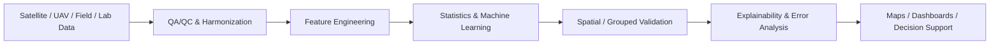

  

<h1 align="center">Priyanka Belbase</h1>

<strong>Agricultural Data Science | Remote Sensing | GeoAI | Machine Learning | Precision Agriculture</strong>

  
  
  
  
  

  <a href="https://www.linkedin.com/in/priyanka-belbase/">LinkedIn</a> •
  <a href="https://scholar.google.com/citations?user=bkSmlQ8AAAAJ&hl=en&oi=ao">Google Scholar</a> •
  <a href="mailto:belbase.priyanka@gmail.com">Email</a>

---

I am completing a **Ph.D. in Earth System Science at Florida International University** and work at the intersection of **agricultural data science, remote sensing, GIS, machine learning, environmental science, Earth observation, and disaster-risk intelligence**.

My work combines **field experiments, plant and soil measurements, hyperspectral reflectance, satellite/UAV observations, Python, GIS, and Google Earth Engine** to build reproducible workflows for crop monitoring, stress/disease screening, flood-event mapping, environmental analysis, validation, and decision support.

## 🌊 Featured Disaster-Risk Project

### [AI Flood Intelligence & Event Mapping](https://github.com/belbasepriyanka/sar-flood-mapping-change-detection)
**Sentinel-1 SAR • flood detection • change detection • event mapping • uncertainty • exposure/risk intelligence • FastAPI • Streamlit**

An end-to-end disaster-intelligence project built around pre/post SAR analysis, terrain and permanent-water screening, validation, flood confidence, threshold-ensemble uncertainty, population/road/critical-asset exposure, analyst prioritization, dashboard review, and API-based platform integration.

**Demo outputs:** Accuracy `0.998` • F1 `0.990` • IoU `0.980` • mapped flood extent • uncertainty layer • exposure summary • analyst priority scoring

> The committed local event is synthetic and exists to demonstrate the workflow reproducibly. Numerical metrics are **not operational flood-mapping accuracy claims**; real deployment requires independent event-specific validation.

## 🌱 Agricultural AI & Precision Agriculture Portfolio

These public repositories are designed as **fully runnable recruiter demonstrations**. Where my measured doctoral datasets are not appropriate for public release, the repositories use clearly labeled **synthetic demonstration data generated by code** so the analytical workflow remains reproducible without presenting synthetic outputs as research findings.

### 1. [Dragon Fruit Yield & Flowering Forecasting](https://github.com/belbasepriyanka/Remote-Sensing-GIS-portfolio/tree/main/projects/dragon-fruit-yield-flowering-forecasting)
**Predictive ML • time series • weather • field experiments • grouped validation**

A 72-plant, repeated-observation agricultural ML demonstration integrating weather, crop growth, management treatment, nutrients, NDVI/NDRE, flowering, fruit set, and season-level yield. Uses **GroupKFold by plant ID** to reduce repeated-measure leakage.

**Demo outputs:** flowering ROC AUC `0.890` • season-yield R² `0.893` • notebooks • figures • tests • machine-readable results

---

### 2. [Dragon Fruit Nutrient & Stress Decision Support](https://github.com/belbasepriyanka/sentinel2-vegetation-health-monitoring)
**Soil + tissue + spectral indicators • ML • anomaly detection • precision agriculture**

Integrates soil/tissue nutrients, weather, canopy moisture, NDVI, NDRE, NDMI, red-edge, NIR, and SWIR features into a stress-screening and scouting-priority workflow. Includes **Random Forest**, **Isolation Forest**, Sentinel-2 **Google Earth Engine**, and a **Streamlit dashboard**.

**Demo outputs:** stress accuracy `94.4%` • ROC AUC `0.949` • nutrient regression • 0–100 risk score • Normal/Monitor/Inspect decision support

---

### 3. [AI Dragon Fruit Disease Scouting & Risk Dashboard](https://github.com/belbasepriyanka/hyperspectral-plant-stress-ml)
**Hyperspectral ML • PCA • Random Forest • SVM • anomaly detection • dashboard**

An end-to-end spectral scouting architecture using synthetic hyperspectral signatures from **400–1000 nm**, grouped validation by plant, Random Forest vs PCA+SVM benchmarking, healthy-reference anomaly detection, and an operational scouting-risk dashboard.

**Demo outputs:** Random Forest accuracy `99.7%` • PCA+SVM accuracy `99.4%` • PCA summary • risk scoring • Streamlit dashboard

> High disease-demo scores reflect deliberately separable synthetic signatures and are **not field diagnostic accuracy claims**.

---

### 4. [Dragon Fruit Remote Sensing & Precision Agriculture](https://github.com/belbasepriyanka/dragon-fruit-remote-sensing-precision-agriculture)
**Field experiments • nutrients • spectroscopy • satellite workflows • machine learning**

A broader end-to-end agricultural data-science project connecting a 72-plant experimental structure, field/soil/tissue/spectral/weather features, grouped ML validation, Sentinel-2 processing, figures, notebooks, tests, and reproducible outputs.

## 🔬 Other Featured Geospatial Projects

- [Geospatial Land-Cover ML](https://github.com/belbasepriyanka/geospatial-land-cover-ml) — Random Forest with spatial-block validation
- [LiDAR Canopy & Terrain Analysis](https://github.com/belbasepriyanka/lidar-canopy-terrain-analysis) — DTM, DSM, CHM and vegetation structure
- [Geospatial Raster ETL & QA/QC](https://github.com/belbasepriyanka/Remote-Sensing-GIS-portfolio/tree/main/projects/geospatial-raster-etl-qaqc) — reproducible raster engineering
- [Spatial Validation Benchmark](https://github.com/belbasepriyanka/Remote-Sensing-GIS-portfolio/tree/main/projects/spatial-validation-benchmark) — random split vs spatial holdout
- [Terrain & Hydrology Modeling](https://github.com/belbasepriyanka/Remote-Sensing-GIS-portfolio/tree/main/projects/terrain-hydrology-modeling) — DEM, D8 flow and accumulation

## End-to-End Workflow

## Technical Toolkit

| Area | Tools & Methods |
|---|---|
| **Programming** | Python, R, SQL, JavaScript, ArcPy |
| **Data Science** | NumPy, Pandas, GeoPandas, scikit-learn, Matplotlib |
| **Machine Learning** | Random Forest, SVM, Gradient Boosting, PCA, classification, regression, anomaly detection |
| **GIS** | ArcGIS Pro, ArcGIS Online/Enterprise, QGIS, Google Earth Engine, PostGIS |
| **Remote Sensing** | Sentinel-1/2, Landsat, PlanetScope, NAIP, hyperspectral/multispectral, UAV, LiDAR |
| **Validation & QA/QC** | grouped/spatial holdout, confusion matrices, F1, ROC AUC, IoU, MAE, R², metadata, data-quality checks |
| **Decision Support** | Streamlit, FastAPI, ArcGIS Dashboards, Power BI, Tableau |
| **Reproducibility** | Git/GitHub, requirements files, tests, notebooks, documented project structures |

## Research Focus

My doctoral research integrates **field experiments, plant and soil measurements, hyperspectral reflectance, vegetation indices, statistical analysis, GIS, and remote sensing** to study crop growth, nutrient status, disease signals, and environmental responses under different growing conditions.

My broader goal is to translate agricultural, environmental, and disaster geospatial data into **defensible analytical workflows and decision-support products**, while keeping measured research findings clearly separate from public synthetic portfolio demonstrations.

## Selected Research & Publications

My peer-reviewed research covers remote sensing, hyperspectral sensing, plant nutrient assessment, disease detection, vegetation monitoring, precision agriculture, GIS, and environmental science.

📚 [View publications on Google Scholar](https://scholar.google.com/citations?user=bkSmlQ8AAAAJ&hl=en&oi=ao)

---

**Agricultural Data Science • Remote Sensing • GeoAI • Machine Learning • Disaster Risk Intelligence • Precision Agriculture • GIS • Python**